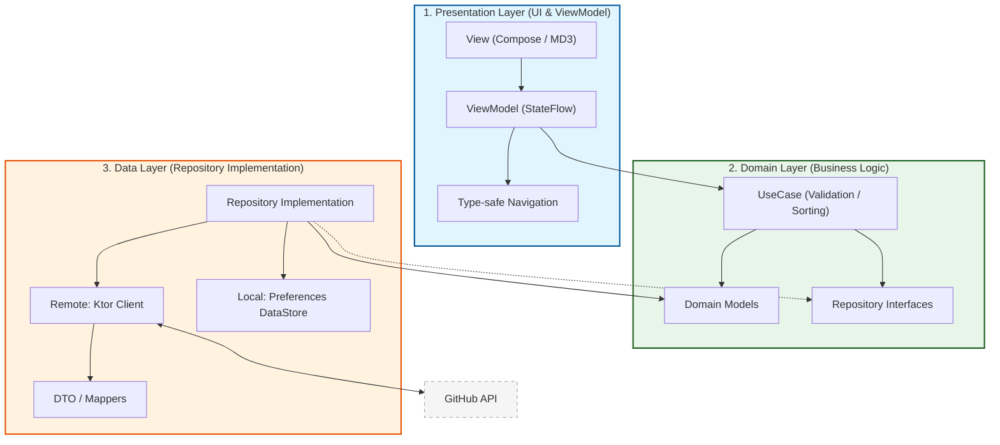

# 構成設計 (Architecture Design)

このドキュメントでは、SamplePandaAI プロジェクトのアーキテクチャ設計について記述します。
本プロジェクトは、GitHub API からのデータ取得に加え、DataStore による履歴管理、Type-safe Navigation
による画面遷移を備えたクリーンアーキテクチャを採用しています。

## アーキテクチャ図解

本プロジェクトは以下の3つの主要レイヤーで構成され、Data層は Remote (Ktor) と Local (DataStore)
の2つのデータソースを持ちます。

## アーキテクチャ階層

### 1. Presentation Layer (UI & ViewModel)

- **技術**: Jetpack Compose (Material Design 3), ViewModel, Type-safe Navigation
- **責務**:
  - UI の構築と状態保持（StateFlow）。
  - ユーザー入力の受付と ViewModel へのイベント委譲。
  - `strings.xml` を介した多言語対応・文言管理の徹底。
- **遷移設計**: Kotlin Serialization を用いた型安全な Navigation (Object/Class ベース) を採用。

### 2. Domain Layer (Business Logic)

- **技術**: Pure Kotlin (UseCase)
- **責務**:
  - アプリケーション固有のビジネスロジック（入力バリデーション、データのソート順定義など）。
  - Repository インターフェースによるデータ層の抽象化。
- **主要な UseCase**:
  - `ValidateGitHubUserNameUseCase`: GitHub の命名規則に基づくバリデーション。
  - `GetUserNameHistoryUseCase`: 保存された履歴の取得と順序制御。

### 3. Data Layer (Repository Implementation)

- **技術**: Ktor (Remote), Preferences DataStore (Local), Kotlin Serialization
- **責務**:
  - **Remote**: GitHub API からのリポジトリ情報取得。
  - **Local**: 入力履歴（List<String>）の永続化管理。
  - **Mapping**: API/DataStore 固有のデータ型（DTO）からドメインモデルへの変換。

## 通信・永続化戦略

### ネットワーク (Ktor)

`HttpClientEngine` を差し替え可能にし、本番環境 (`OkHttp`) とテスト環境 (`MockEngine`) を分離。

### 永続化 (DataStore)

軽量な設定値やリスト保存のために `Preferences DataStore` を採用。`UserNameRepositoryImpl`
を通じて透過的にアクセス。

## ログ・テスト基盤

- **Logging**: SLF4J + Logback-Android。Android ログクラスに依存せず、JVM 単体テスト環境でも動作。
- **Testing Strategy**:
  - **Unit Test**: JVM 上で MockK を用いて UseCase/ViewModel を検証。
  - **Integration Test**: Hilt を用いた実機/エミュレータ上の画面遷移・永続化検証。
  - **MD3 Verification**: Compose Preview を活用した視覚的バリエーション検証。

## 現状の懸念事項・技術的負債

- **ビルド構成の非推奨警告**: OpenAPI Generator と Gradle 8.x のパス指定における Deprecated
  警告（継続監視中）。
- **ライセンス管理**: 依存 OSS ライブラリの `LICENSE.md` 衝突回避のため `packaging` オプションで
  `exclude` している。将来的に設定画面等でのライセンス表示実装が必要。
