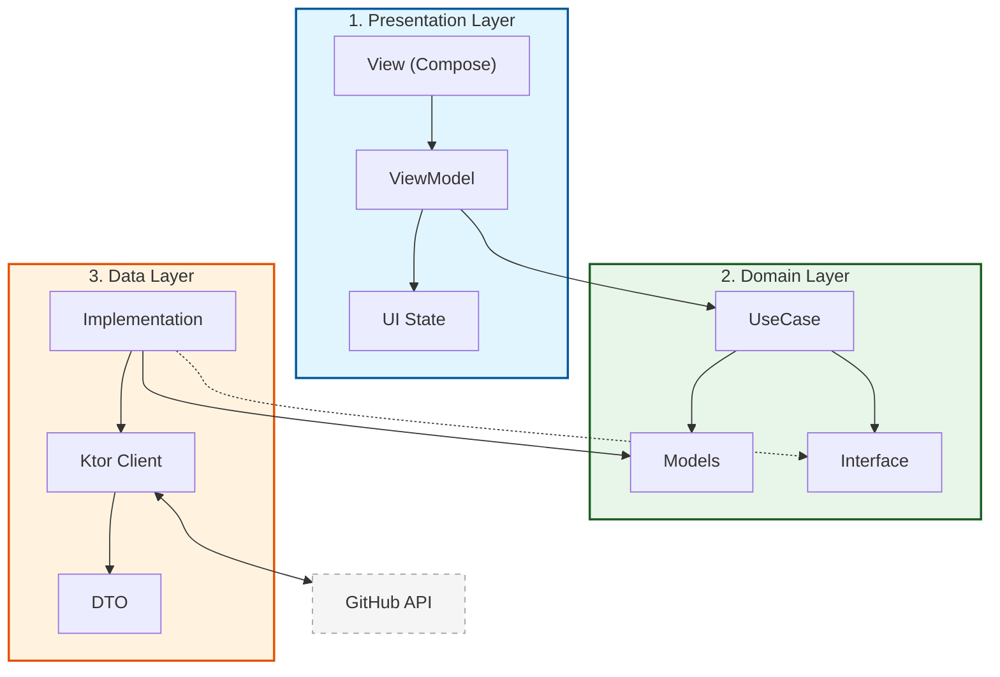

# 構成設計 (Architecture Design)

このドキュメントでは、GitHub APIを使用してリポジトリリストを表示する機能のアーキテクチャ設計について記述します。
特に「試験フェーズ」を重視し、各レイヤーでの単体テストおよびKtorを用いた通信周りの柔軟なテスト構成を検証します。

## アーキテクチャ図解

本プロジェクトは以下の3つの主要レイヤーで構成されます。



## アーキテクチャ階層

Clean Architectureの考え方に基づき、以下の3レイヤー構成を採用します。

### 1. Presentation Layer (UI & ViewModel)

- **技術**: Jetpack Compose, ViewModel
- **責務**: UIの構築、状態管理、ユーザーインタラクションの処理.
- **テスト**:
    - **ViewModel単体テスト**: UseCaseをモックし、UI状態（State）の遷移を検証。
    - **Compose UIテスト**: UIコンポーネントの表示・挙動を検証。

### 2. Domain Layer (Business Logic)

- **技術**: UseCase (Pure Kotlin)
- **責務**: アプリケーション固有のビジネスロジック。
- **テスト**:
    - **UseCase単体テスト**: Repositoryをモックし、ビジネスロジックの正当性を検証。

### 3. Data Layer (Repository & Remote/Local Source)

- **技術**: Ktor, Kotlin Serialization
- **責務**: データの取得（GitHub API）とドメインモデルへの変換。
- **テスト**:
    - **Repository単体テスト**: Ktorの `MockEngine` を使用し、ネットワーク層のレスポンス処理を検証。
    - **対抗試験**: 実サーバーまたはモックサーバーへの接続試験。

## 共通基盤 (Infrastructure / Cross-Cutting Concerns)

### ログ基盤 (Logging)

- **技術**: SLF4J (Simple Logging Facade for Java)
- **実装**: `logback-android` (Android環境), `slf4j-simple` (JUnitテスト環境)
- **選定理由**:
    - 抽象化レイヤーとして機能し、テスト時にログの実装を容易に差し替えられる。
    - JVM上での純粋な単体テスト（Domain層など）でも、Androidの `Log` クラスに依存せずログ出力が可能。
    - Ktor 内部でのログ出力との親和性が高い。

## 通信周りの設計 (Ktor Engine Strategy)

Ktorの `HttpClient` 構成において、 `HttpClientEngine` を差し替え可能にすることで、様々な試験シナリオに対応します。

| シナリオ            | エンジン               | 目的                               |
|:----------------|:-------------------|:---------------------------------|
| **本番 / デバッグ実行** | `OkHttp` または `CIO` | 実際のネットワーク通信。                     |
| **ユニットテスト**     | `MockEngine`       | サーバーを介さず、定義したJSONレスポンスを返す。       |
| **外部モックサーバー対抗** | `OkHttp`           | 実際のHTTPプロトコルを用いた外部モックサーバーとの通信検証。 |

## 予定されるパッケージ構成

```text
com.example.samplepandaai/
├── data/
│   ├── remote/          # Ktor API Client, DTO
│   └── repository/      # Repository 実装
├── domain/
│   ├── model/           # ドメインモデル
│   ├── repository/      # Repository インターフェース
│   └── usecase/         # UseCase クラス
├── ui/
│   ├── features/        # 機能ごとのCompose UI
│   └── viewmodel/       # ViewModel
└── util/
    └── logging/         # ログ関連のユーティリティ（必要な場合）
```

## 懸念事項・技術的負債

### ビルド構成における Deprecated 警告

- **事象**: `app/build.gradle.kts` において、自動生成ソースの登録に使用している `srcDir` および
  `buildDir` が Gradle 8.x 以降で非推奨（Deprecated）となっている。
- **背景**: 最新の推奨 API (`layout.buildDirectory`, `androidComponents` 等) への移行を試みたが、OpenAPI
  Generator プラグインのタスクプロパティ (`GenerateTask.outputDir`) が `Property<String>` であること、および
  Gradle のタスク依存関係の厳格化により、遅延評価（Lazy Evaluation）の連鎖においてビルドエラー（Provider
  解決ループ）が発生する。
- **現状の対策**:
  現時点ではビルドの安定性を最優先し、非推奨警告を許容した上で、最もシンプルで確実なパス文字列指定による構成を採用している。将来的にプラグインの型定義が改善される、あるいは
  AGP 側の API がより柔軟になるまで継続的な監視が必要。
