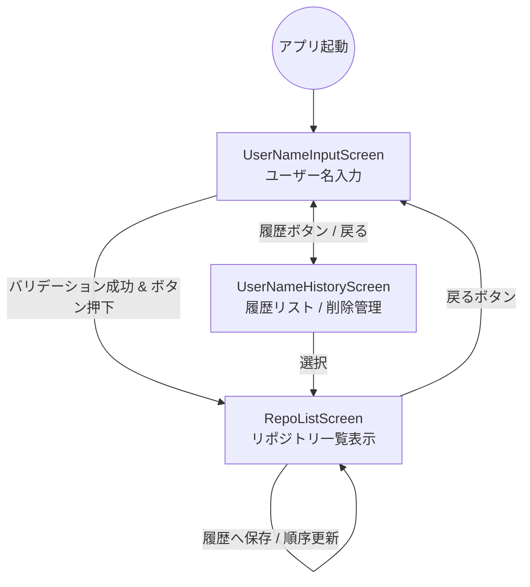

# 機能追加 1: ユーザー名入力画面の追加

## 概要

アプリの利用開始時にユーザー名を入力するための画面を追加します。入力されたユーザー名は、GitHub
APIでのリポジトリ取得に使用されます。また、利便性向上のため過去に入力したユーザー名を履歴として保存し、独立した履歴画面から選択・管理（削除）できるようにします。

## 開発指針

本機能の実装にあたっては、以下のプロジェクト指針を厳守します：

- **docs/PROJECT_STRUCTURE.md**: 定められたレイヤー構造（Data/Domain/UI）に従い、適切なパッケージに配置する。
- **docs/AGENTS.md & docs/GEMINI.md**: 実在するコードを検索・確認した上で実装を行い、推測に基づく生成を排除する。

## ゴール

- ユーザーが名前を入力できる。
- GitHubの命名規則に沿ったバリデーションを行い、不正な入力では次へ進めないようにする。
- 過去に入力（成功）したユーザー名が全画面のリスト（履歴画面）で表示される。
- 履歴リストからユーザー名を選択してリポジトリ一覧へ遷移、または個別に履歴を削除できる。
- **ソート順**: 最後に使用（成功）した日時が新しい順に表示される。

## 画面遷移図

## 仕様詳細

### ユーザー名バリデーションルール

GitHubの仕様に基づき、以下の制約を設けます：

- 英数字（a-z, A-Z, 0-9）および単一のハイフン（-）のみ使用可能。
- ハイフンで開始または終了することはできない。
- ハイフンを連続して使用することはできない。
- 最大文字数は 39 文字とする。
- 空文字は許可しない。

### 履歴機能 (UserNameHistoryScreen)

- **ソート順**: 使用（リポジトリ取得成功）した日時が新しい順。
- **削除機能**: 項目ごとの個別削除。
- **永続化**: `Preferences DataStore` を使用し、`List<String>` を保存。
- **最大件数**: 5 件。

## 技術設計

### 依存関係の追加

以下のライブラリを追加実装します：

- `androidx.navigation:navigation-compose`: 画面遷移管理
- `androidx.hilt:hilt-navigation-compose`: ViewModel の DI 連携
- `androidx.datastore:datastore-preferences`: 履歴の永続化

### レイヤー別実装方針

命名規則を `UserName` に統一し、クリーンアーキテクチャのレイヤー構造を厳守します。

- **UI (Presentation)**:
    - `UserNameInputScreen` / `UserNameInputViewModel`
    - `UserNameHistoryScreen` / `UserNameHistoryViewModel`
- **Domain (UseCase)**:
    - `GetUserNameHistoryUseCase`: 履歴一覧を取得する。
    - `AddUserNameToHistoryUseCase`: 履歴にユーザー名を追加・更新する。
    - `DeleteUserNameFromHistoryUseCase`: 履歴からユーザー名を削除する。
    - `UserNameRepository` (interface): 履歴データの抽象化。
- **Data**:
    - `UserNameRepositoryImpl`: `DataStore` を用いた具体的な永続化処理。

## テスト計画

- **Unit Test**:
    - 各 UseCase の単体テスト。
    - `UserNameInputViewModel` のバリデーションテスト。
    - `UserNameRepositoryImpl` における履歴のソート・重複排除・削除ロジックのテスト。
- **UI Test**:
    - `UserNameInputScreen` ↔ `UserNameHistoryScreen` 間の遷移および動作確認。
