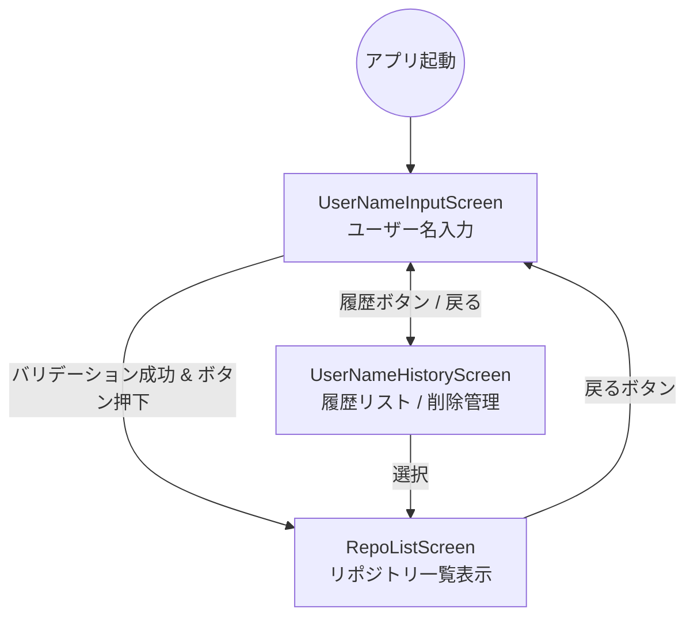

# 機能追加 1: ユーザー名入力画面の追加

## 概要

アプリの利用開始時にユーザー名を入力するための画面を追加します。入力されたユーザー名は、GitHub
APIでのリポジトリ取得に使用されます。また、利便性向上のため過去に入力したユーザー名を履歴として保存し、独立した履歴画面から選択・管理（削除）できるようにします。

## 開発指針
本機能の実装にあたっては、以下のプロジェクト指針を厳守します：
- **docs/PROJECT_STRUCTURE.md**: 定められたレイヤー構造（Data/Domain/UI）に従い、適切なパッケージに配置する。
- **docs/AGENTS.md & docs/GEMINI.md**: 実在するコードを検索・確認した上で実装を行い、推測に基づく生成を排除する。
- **Material Design 3 (MD3)**: `OutlinedTextField` 等の標準コンポーネントをガイドラインに従って使用する。
- **文字列リソース化**: UI上の文言はすべて `strings.xml` で管理し、ハードコードを排除する。

## ゴール
- ユーザーが名前を入力できる。
- GitHubの命名規則に沿ったバリデーションを行い、不正な入力では次へ進めないようにする。
- 過去に入力（成功）したユーザー名が全画面のリスト（履歴画面）で表示される。
- 履歴リストからユーザー名を選択してリポジトリ一覧へ遷移、または個別に履歴を削除できる。
- **ソート順**: 最後に使用（成功）した日時が新しい順に表示される。

## 画面遷移図

## 仕様詳細

### ユーザー名バリデーションルール
GitHubの仕様に基づき、以下の制約を設けます：
- 英数字（a-z, A-Z, 0-9）および単一のハイフン（-）のみ使用可能。
- ハイフンで開始または終了することはできない。
- ハイフンを連続して使用することはできない。
- 最大文字数は 39 文字とする。
- 空文字は許可しない。

### 履歴機能 (UserNameHistoryScreen)
- **ソート順**: 使用（リポジトリ取得成功）した日時が新しい順。
- **削除機能**: 項目ごとの個別削除（アクセシビリティ対応のContentDescription付与）。
- **永続化**: `Preferences DataStore` を使用し、`List<String>` を保存。
- **最大件数**: 5 件。

### UI/UX 実装方針 (MD3準拠)

- **入力フィールド**: `OutlinedTextField` の `label` 引数を使用し、枠線上にフローティングラベルを表示。
- **エラー表示**: `isError` 状態と `supportingText` を使用し、フィールド下部に赤文字でエラーメッセージを表示。
- **多言語対応準備**: すべての文言を `strings.xml` から取得。

## 技術設計

### 依存関係

- `androidx.navigation:navigation-compose`: Type-safe Navigation (Kotlin Serialization)
- `androidx.hilt:hilt-navigation-compose`: ViewModel の DI 連携
- `androidx.datastore:datastore-preferences`: 履歴の永続化

### レイヤー別実装

命名規則を `UserName` に統一し、クリーンアーキテクチャを遵守。

- **UI**: `UserNameInputScreen`, `UserNameHistoryScreen`, `RepoListScreen` (戻るボタン追加)
- **Domain**: `ValidateGitHubUserNameUseCase`, `GetUserNameHistoryUseCase` 等
- **Data**: `UserNameRepositoryImpl` (DataStore 永続化ロジック)

## テスト結果 (検証済み)

以下のテストがすべて成功し、品質が担保されていることを確認済み。

- **Unit Test**:
  - `ValidateGitHubUserNameUseCaseTest`: バリデーション全パターンの成功。
  - `UserNameInputViewModelTest`: 状態遷移の正常性。
  - `UserNameHistoryViewModelTest`: 履歴取得と `StateFlow` のアクティブ化（collect）の検証。
- **UI / Integration Test**:
  - `UserNameIntegrationTest`: 入力 ➔ 履歴 ➔ 遷移 ➔ 戻る の一連のフロー確認。
  - `RepoListScreenTest`: 戻るボタンの表示とコールバックの動作確認。
